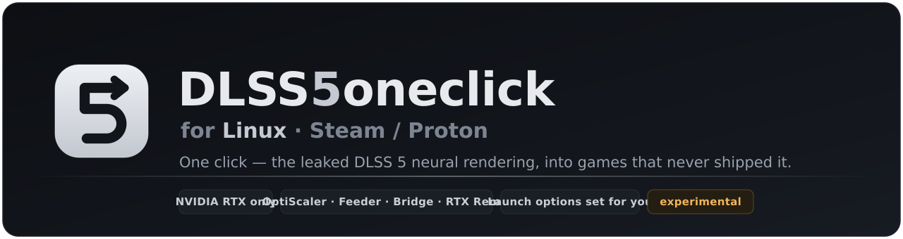
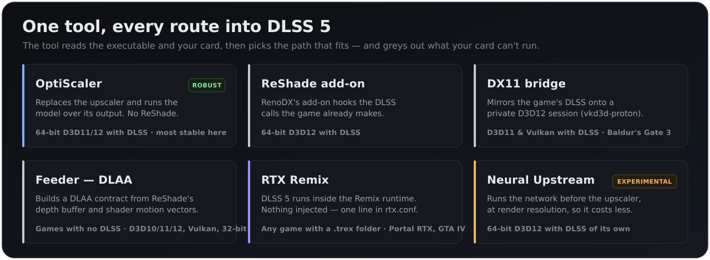

<p align="center">
  
</p>

<p align="center">
  <a href="https://github.com/Mhsbrian/DLSS5oneclick-forlinux/actions"></a>
  <a href="https://github.com/Mhsbrian/DLSS5oneclick-forlinux/releases/latest"></a>
  
  
  
  
  
  
</p>

One button that sets up the **leaked DLSS 5 neural-rendering build** in DirectX 11/12 games running under **Steam/Proton** (Heroic and Lutris games work too). This is the Linux port of [faisalkindi/DLSS5oneclick](https://github.com/faisalkindi/DLSS5oneclick) — same installer, plus everything a Linux gaming box actually needs: your Steam library listed in the app, the Proton launch options set for you, Linux GPU/driver checks, and native Linux builds.

Single native binary, no runtime. Everything it installs is downloaded from the projects that made it; the only third-party content inside the binary is three SIL-OFL fonts.

Download: [latest release](https://github.com/Mhsbrian/DLSS5oneclick-forlinux/releases/latest) → `dlss5oneclick-linux-x86_64` (portable binary) or `dlss5oneclick-x86_64.AppImage`.

```
chmod +x dlss5oneclick-linux-x86_64
./dlss5oneclick-linux-x86_64
```

Works on any x86_64 gaming distro with glibc ≥ 2.35 (Arch/CachyOS/EndeavourOS, Bazzite, Nobara, Fedora, Ubuntu/Mint/Pop!_OS, openSUSE, SteamOS desktop mode). Wayland and X11 both fine; the file picker uses the XDG portal.

> **⚠️ This is a leaked, unofficial feature, and it is genuinely unstable under Proton.** The installer is solid and well-tested; what it installs is a signed neural runtime that can crash the GPU inside Proton's translation layers — most often a few seconds into loading, worst at 4K and with DLSS Frame Generation on. Some game + Proton combinations work beautifully, others fault every launch. **Read [Will it actually work?](#will-it-actually-work-stability-under-proton) before you start**, treat it as an experiment, and lean on `--diagnose`.

<p align="center">
  
</p>

## What the Linux version adds

- **Game library built in.** Your installed Steam games (native, Flatpak or Snap Steam, all library folders), Heroic (Epic/GOG) and Lutris games are listed in the app — click one instead of hunting for the folder. `--list-games` does the same in the terminal, and the CLI takes a game name or Steam appid: `dlss5oneclick "skyrim special"`.
- **Launch options handled.** ReShade/OptiScaler load as `dxgi.dll`, which Proton only picks up with `WINEDLLOVERRIDES="dxgi=n,b" %command%` in the game's launch options. After an install the tool sets this **for you** (Steam closed: it edits `localconfig.vdf` surgically, with backups; Steam running: it shows the exact string with a copy button). Existing launch options are merged, never overwritten — your `MANGOHUD=1`, game arguments, and other DLL overrides survive. `--launch-options` / `--revert-launch-options` do it from the terminal. On old Proton (< 9) `PROTON_ENABLE_NVAPI=1` is added too; Heroic gets its per-game environment variables written (experimental), Lutris users get the exact variables to paste.
- **Linux GPU and driver checks.** The RTX tier (RTX 50 full speed · RTX 40 moderate cost · RTX 20/30 heavy cost) is read from the NVIDIA driver; non-NVIDIA and GTX cards are refused up front, exactly like on Windows. `--diagnose` also verifies the driver's Wine NGX DLLs (`/usr/lib/nvidia/wine`), the kernel driver version, the game's Proton mapping and its prefix — the usual "DLSS silently does nothing" causes on Linux.
- **The neural pass's HLSL compiler, under Proton.** The DLSS 5 add-on compiles its neural-rendering shader at runtime through `d3dcompiler_47`. Proton ships a *builtin* one (backed by vkd3d-shader's still-incomplete HLSL compiler) that doesn't implement every intrinsic the pass uses (`isnan`), so the shader silently fails to compile — everything else looks right, but nothing renders. After an install the tool puts **Microsoft's real `d3dcompiler_47`** into the game's Proton prefix for you (via `protontricks`/`winetricks` when present), and `--diagnose` names this exact cause (`E5005: Function "isnan" is not defined`) and the one-line fix when it can't.
- **The model is checked against your card before it installs.** The 165 MB `nvngx_dlssnr.dll` is compiled for a set of CUDA architectures; the wrong build loads and then silently renders nothing. The tool opens the downloaded model, reads the `sm_XX` architectures its fatbins actually carry, reads your card's exact compute capability from `nvidia-smi`, and **refuses a build that has no code for your card** with the reason — instead of leaving you to debug a silent no-op. It also pins the `renodx-dlss5` add-on to the build your installed DLSS5-Feeder and driver can actually run, avoiding the `CreateFeature 0xC0000005` mismatch.
- **Tune the frame cost, or add frame generation.** Neural rendering is not free — a moderate frame cost on RTX 40, a heavy one on 20/30. A **Model resolution** slider (`--model-res`, OptiScaler engine) runs the neural model at a fraction of native — 75 % ≈ half the cost, 50 % ≈ a quarter — while the frame keeps full detail. And **FSR 3.1 frame generation** (`--fg`, any RTX card, D3D12) switches on the frame-gen libraries OptiScaler already ships, for a 2× frame count. Both are experimental under Proton — see [Will it actually work?](#will-it-actually-work-stability-under-proton) below.
- **See it, diagnose it, report it.** **Before / after** puts your two newest ReShade screenshots side by side (shoot with neural rendering off, toggle it on, shoot again). **`--diagnose`** reads the *right* log for the route — `OptiScaler.log` on the OptiScaler engine, not just `ReShade.log` — and names why nothing rendered, **including the GPU device-lost crash** the runtime can hit under Proton, with the cheapest fix first. **Report a bug** opens a GitHub issue prefilled with your version, card, driver, route, last diagnosis and log tails — nothing is sent until you submit it.
- **RTX 40 DLSS Multi-Frame-Generation unlock** (optional, `--mfg` or a GUI checkbox). For RTX 40 cards, on games that already have DLSS Frame Generation (Cyberpunk 2077, …), it raises the multiplier to 2X–6X via [dashdogy/RTX40MFG-Unlock](https://github.com/dashdogy/RTX40MFG-Unlock) (MIT). The tool downloads it plus Ultimate ASI Loader, places the loader under a proxy DLL the game imports (`version.dll`/`winmm.dll`, never `dxgi` — ReShade owns that), and adds that proxy's `WINEDLLOVERRIDE` to the launch options automatically. **Experimental under Proton**: the mod validates a Streamline FG wrapper the NVIDIA App supplies on Windows, which Proton's may not match — it may "fail closed", and `--diagnose` reads its log to say whether it engaged. Off by default; the checkbox is disabled with a reason on non-RTX-40 cards or games without Frame Generation.
- **RTX Remix support.** A game with an RTX Remix mod runs DLSS 5 inside the Remix runtime — the tool auto-detects it and installs there. See [RTX Remix games](#rtx-remix-games).
- **Self-updating from this repo**, AppImage included.

Everything else is upstream (currently merged at 0.11.24), unchanged: the two install paths, the OptiScaler engine, the games grid with posters (games this tool installed are grouped first and flagged when out of date — right-click a card to update it), optional per-game **RenoDX HDR mods** (`--renodx`), automatic **REFramework** for RE Engine games, DLSS5-Feeder betas named when taken, component refresh on reinstall, 32-bit games via the host64 helper, Direct3D 10 recognition, the detection override (`--mode=feeder|native`), and `--check` / `--remove` / anti-cheat refusals (`--ignore-anticheat` to override at your own risk). Upstream 0.11.6–0.11.24 also lands here: DLSS Neural Rendering is switched on in OptiScaler's ini at install (no more per-launch toggle), the game exe is found up to four folders deep, Vulkan games are named honestly (refused only for the ReShade engine — OptiScaler can still reach them), a game's own `OptiScaler.ini` survives a refresh, RE Engine gets the four settings that stop Dragon's Dogma 2 crashing, downloads are cached and reused — on Linux under `~/.cache/dlss5oneclick/downloads` (the 165 MB model is fetched once, not per game) — and, most recently: an experimental **Neural Upstream** consumer (`--upstream`, matiasLombo's `nvngx.dll.addon64`, runs the network at render resolution instead of after the upscaler, offered as an alternative to the RenoDX add-on on a game that has DLSS of its own); DirectX 9 games are named as such and refused with the dgVoodoo2 route rather than mis-installed as DX12, while a D3D9 game that already has dgVoodoo2 beside it is taken as the DX11 game it now is (a `d3d9.dll` import for `D3DPERF_*` debug markers alone — RDR2, Romancing SaGa — is no longer misread as Direct3D 9); a folder with only a 32-bit exe (Max Payne) is found on folder-pick, `.bin` launchers (Aion) are candidates, an unclassified game reads "Unknown" rather than "DirectX 12?", and `--imports` prints exactly what the scan reads from an exe. The hybrid-machine GPU preference upstream added (0.10.7, and the `NvOptimusEnablement`/`AmdPowerXpressRequestHighPerformance` exe exports in 0.11.15) is a Windows-only affair with no Linux effect — under Proton the compositor and PRIME decide the GPU. See [upstream's README](https://github.com/faisalkindi/DLSS5oneclick#readme) for the full story of what gets installed and from where.

## Use

1. Run the binary. The **Games** page lists your installed games with artwork; pick one (or **Add a folder** / **Add a game** for anything else — a hand-added game is remembered in an **Added by you** section; right-click its card to forget it).
2. **Install DLSS 5**.
3. Let it set the launch options (or paste the shown string into Steam → right-click the game → Properties → Launch Options yourself). Restart Steam if it edited the file.
4. In game: **Home** opens ReShade → **Add-ons** tab → **DLSS 5 Neural Rendering** panel → enable it. **F6** toggles, **F5** saves the add-on's screenshot. On the OptiScaler engine: **Insert** opens the overlay instead. **Keep the game's own DLSS on** — neural rendering reads its output. If the game crashes on load or stutters, **turn DLSS Frame Generation off and set DLSS to DLAA** first (see [stability](#will-it-actually-work-stability-under-proton)).

If nothing seems to happen in game — or it crashes — run `--diagnose` (button or CLI). It reads the route's log and the host setup and says exactly what is wrong, including the GPU crash the neural runtime can hit under Proton and how to work around it. To *see* the difference, take a ReShade screenshot with neural rendering off, toggle it on and take another, then press **Before / after** — the tool puts the two newest shots side by side. If something is wrong, **Report a bug** opens a GitHub issue already filled in with your version, card, driver, game, route, the last diagnosis and log tails — nothing is sent until you submit it in the browser.

CLI: `dlss5oneclick <folder | name | appid>` installs · `--check` detect only · `--diagnose` · `--imports` (print the exe's import table and the API the scan reads) · `--remove` / `--remove-all` · `--engine=opti` · `--fg` (OptiScaler FSR 3.1 frame generation, any RTX card) · `--model-res=25..100` (OptiScaler neural model resolution — cost falls with the square, 75 ≈ half) · `--renodx` · `--upstream` (experimental Neural Upstream consumer) · `--mfg` · `--mode=feeder|native` · `--bridge` (force the DX11 bridge when the renderer can't be proven) · `--remix-swap` (replace an RTX Remix runtime that has no neural pass) · `--remix-list` (list known RTX Remix projects, mark the ones you own) · `--install-remix-mod` / `--remove-remix-mod` (download & lay in a game's Remix mod, or take it back out) · `--ignore-anticheat` · `--launch-options` / `--revert-launch-options` · `--list-games` · `--update`.

**Games with a DX11/Vulkan choice** (Baldur's Gate 3 and friends): the exe picker prefers the exe that provably renders Direct3D — BG3 resolves to `bg3_dx11.exe`, gets the [dlss5-bridge](https://github.com/NIGos/dlss5-bridge) (D3D11 DLSS mirrored onto D3D12; under Proton that lands on vkd3d-proton, supported by bridge 1.4.6+), and you pick **DirectX 11** in the game's launcher. The Vulkan exe cannot carry this stack. `--diagnose` verifies the bridge is present and that its D3D12 session opened.

## Will it actually work? Stability under Proton

**Read this before you get excited.** DLSS 5 neural rendering is a **leaked, unofficial** build of a feature NVIDIA shipped for exactly one game (NBA 2K27, RTX 50, Windows). The community re-targeted its runtime for older cards and wired it into other games; this tool automates that setup. On Windows it is already experimental. **Under Proton it is more so**, and being honest about that up front saves you an evening.

What the tool controls is solid and well-tested: it finds the game, installs the right parts, checks the model against your card, writes the config, sets the launch options, and takes it all back out cleanly. What it **cannot** control is how the signed neural runtime behaves once it is running *inside* Proton's translation layers — DXVK (D3D11), VKD3D-Proton (D3D12) and dxvk-nvapi (NVAPI). That is where the instability lives, and it is not a fault in the installer.

**The failure you are most likely to hit** is a GPU crash a few seconds into loading a game: an `Xid` fault in `journalctl -k` and `VK_ERROR_DEVICE_LOST` in the log. The signed neural runtime and Proton's NVAPI don't fully agree, and it faults hardest at high resolution and **with DLSS Frame Generation turned on**. `--diagnose` now reads the log and names this exact crash.

If a game crashes or renders nothing, work down this ladder — cheapest first:

1. **Turn DLSS Frame Generation OFF in the game's own settings, and set DLSS to DLAA** (or Quality). Frame Generation running alongside neural rendering is the single most common crash under Proton. This is a *game* setting, not a tool setting.
2. **Lower the model resolution** — the tool's **Model resolution** slider, or `--model-res=50`. The neural model then runs at a fraction of the pixels (a quarter at 50 %), a large drop in GPU load; the frame itself keeps full detail.
3. **Lower the game's output resolution** (e.g. 1440p) — smaller textures through the DX11↔D3D12 interop.
4. **Try a different Proton.** You are usually on `proton_experimental`, which changes under you; a specific GE-Proton or an older stable can behave very differently.
5. **Prefer the OptiScaler engine** for a game with its own DLSS — it is the most robust path here and needs no ReShade.
6. If it still faults, this particular game + Proton + the leaked runtime simply don't agree yet. **Remove** it and move on; it gets better as the components do.

The same RTX 4090 box has both run neural rendering cleanly and crashed the GPU with it, depending on the game, the resolution and the Proton build — that is the nature of an unofficial feature on a translation layer, not something the installer can promise away. Treat it as a fun experiment, lean on `--diagnose`, and keep the backups the tool makes for you.

## RTX Remix games

A game with an **RTX Remix** mod (a `.trex/` runtime folder beside it — Portal RTX, Half-Life 2 RTX, community mods for GTA IV, NFS Underground 2, Morrowind and more) takes a route of its own: DLSS 5 runs *inside* the Remix runtime, so nothing is injected — no ReShade, no OptiScaler. The tool auto-detects the `.trex` runtime, drops `nvngx_dlssnr.dll` into it, reads which neural fork the runtime is (`rtx.neuralUplift` vs `rtx.neuralRendering`), and flips the one matching line in `rtx.conf`. In game: **Alt+X → Developer Settings → Post-Processing → enable Neural Uplift**. If the installed runtime ships no neural pass at all, `--remix-swap` (or the GUI checkbox) replaces it with a DLSS 5-capable community runtime (the original is backed up; experimental — it can undo a mod's own fixes). Remove reverses all of it and leaves the mod itself untouched.

**Finding and getting the mod.** You don't need to already have a Remix mod. The tool carries a **catalogue of ~22 known RTX Remix projects** and matches it against your library: `--remix-list` prints them all and marks the ones you own (and when you pick a matching game in the app, a panel offers it). For the projects that publish a **complete build as a plain zip** (Grand Theft Auto IV today), `dlss5oneclick "<game>" --install-remix-mod` (or the panel's **Download & install** button) fetches it, finds the `.trex/` runtime inside the archive, lays it in over the base game (backing up anything it replaces, manifest-tracked so `--remove-remix-mod` puts it all back), and then the Remix route installs DLSS 5 on top. Everything else links out to the mod's page — a mod that ships source or a bare proxy is told apart at download time and never half-installed.

**Experimental under Proton**: Remix runs under Proton, but whether the community runtimes' NGX path fully initialises there is the same dxvk-nvapi question the neural runtime hits elsewhere.

## Launch options details

The required string per game is at most:

```
WINEDLLOVERRIDES="d3dcompiler_47=n;dxgi=n,b" PROTON_ENABLE_NVAPI=1 %command%
```

- `dxgi=n,b` — always: loads ReShade/OptiScaler from the game folder.
- `d3dcompiler_47=n` — only when a native `d3dcompiler_47.dll` sits next to the game exe (many games ship one). Without it Proton's builtin compiler is used, which usually handles the shaders fine; if `--diagnose` shows effect-compile failures, drop a native `d3dcompiler_47.dll` next to the exe (e.g. via `winetricks d3dcompiler_47` into the game's prefix, or copy one from another game) and re-run `--launch-options`.
- `PROTON_ENABLE_NVAPI=1` — only for Proton older than 9 (9+ has NVAPI on by default); harmless when redundant.

Steam edits are atomic and verified: the file is re-parsed after the edit and must be byte-identical apart from that one value, or nothing is written. Backups: `localconfig.vdf.dlss5o.orig` (first ever edit) and `.dlss5o.bak` (before each edit) next to the file, under `~/.local/share/Steam/userdata/<id>/config/`.

## GPU support

NVIDIA RTX only (the DLSS 5 model needs tensor cores and NGX). The `310.8.SF` build the tool installs adds patched binaries for RTX 40 and an FP16 path for RTX 20/30; RTX 50 runs the native FP8 kernels. Before it installs the 165 MB model, the tool opens it and reads the CUDA architectures its fatbins actually carry (`sm_75/86/89/120` for the `.SF` build), then refuses one that has no code for your card rather than let it load and silently produce no neural frame — your card's exact compute capability comes from `nvidia-smi`, and `DLSS5ONECLICK_SKIP_GPU_CHECK=1` overrides. It also pins the `renodx-dlss5` add-on to the build the installed DLSS5-Feeder (and your driver) can actually run — the mismatch behind `CreateFeature 0xC0000005` and the launch-driver feature-18 fault — instead of always taking the newest. The proprietary NVIDIA driver is required — including its Wine/NGX files (`nvngx.dll` under `/usr/lib/nvidia/wine` or your distro's equivalent; package `nvidia-utils` on Arch). Misdetected? `DLSS5ONECLICK_SKIP_GPU_CHECK=1` bypasses the refusal.

## Not handled

Same as upstream: DirectX 9 (except behind dgVoodoo2) and Vulkan-native games (X4, most native Linux ports have no Windows exe at all and are skipped), and games with anti-cheat (EAC, BattlEye, GameGuard, Riot Vanguard, XIGNCODE3, PunkBuster, FACEIT, EA anti-cheat, HoYoverse, ACE — refused; `--ignore-anticheat` at your own risk, and under Proton that risk includes the anti-cheat's Linux path breaking outright). 32-bit DX11 games work since upstream 0.10.0 (Feeder + host64 helper, beta).

- The DLSS 5 add-on and its model are a leaked, closed-source build. The tool downloads whatever the rhi-repo releases currently host and cannot vouch for them.
- Heroic environment-variable writing is experimental (config format tolerances built in; falls back to showing you the variables).
- Lutris: games are listed and installable; add the shown variables in the game's Lutris settings yourself (v1 does not edit Lutris configs).

## Development

Rust 2021, single crate. GUI is egui/eframe; HTTP is reqwest (rustls); archives via the `zip` crate. The crate still compiles on Windows (all Linux integration is `cfg`-gated) so upstream changes merge cleanly.

```
cargo test                                  # no network, no Steam needed
cargo clippy --all-targets -- -D warnings
cargo build --release                       # target/release/dlss5oneclick
packaging/build-appimage.sh                 # optional AppImage
```

Verified 2026-09-07 on Arch (Hyprland/Wayland, RTX 4090, driver 610.57): library discovery against a real Steam install; `--check`/`--diagnose` against Cyberpunk 2077, Bodycam and Baldur's Gate 3; OptiScaler installs that placed the model and switched neural rendering on (composition dispatches confirmed in `OptiScaler.log`); the CUDA fatbin check against the real `.SF` model on disk (reads `{sm_75, 86, 89, 120}`); the `WorkingScale`/frame-gen ini edits against a real 1500-line `OptiScaler.ini`; launch-option merging against real hand-written `localconfig.vdf` entries (idempotent); and the RTX Remix route against a synthetic `.trex` game. The **instability guidance above is not theoretical** — the same box both ran neural rendering cleanly *and* hit `VK_ERROR_DEVICE_LOST` / `Xid` GPU faults at 4K with DLSS Frame Generation on, which is what the diagnosis, the model-resolution dial, and the FG-off advice are for. 175 tests, `clippy -D warnings` clean, on ubuntu and windows CI.

## Credits

This tool only automates other people's work — see [upstream's credits](https://github.com/faisalkindi/DLSS5oneclick#credits) for the full list: crosire (ReShade), jlrouzies-fr (DLSS5-Feeder), Afzaal/Kaidō (LumeniteFX), clshortfuse & the RenoDX community, RankFTW (rhi-repo), NVIDIA, DSOGaming, Dagherbou (OptiScaler_DLSSNR) and the OptiScaler team, NIGos (dlss5-bridge), emilk (egui). And **[faisalkindi](https://github.com/faisalkindi)** for DLSS5oneclick itself, which this port builds on.

## License

MIT for this tool (as upstream). Each downloaded component keeps its own license; the DLSS 5 add-on (`renodx-dlss5.addon64`) is closed source with no license published, and the NVIDIA runtimes are under NVIDIA's terms.
